# HW3
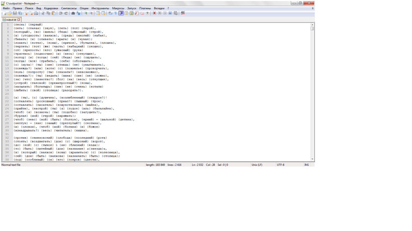
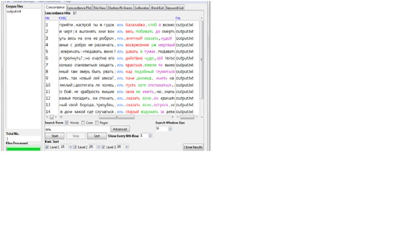
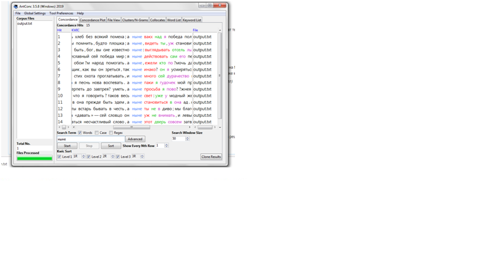
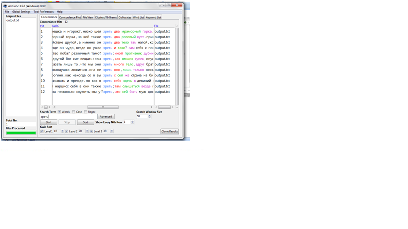
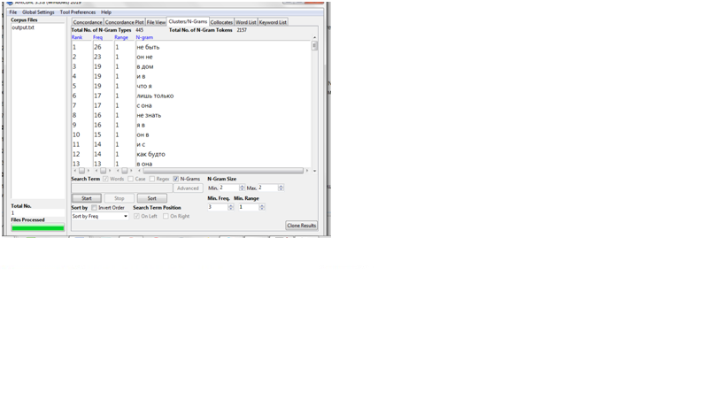
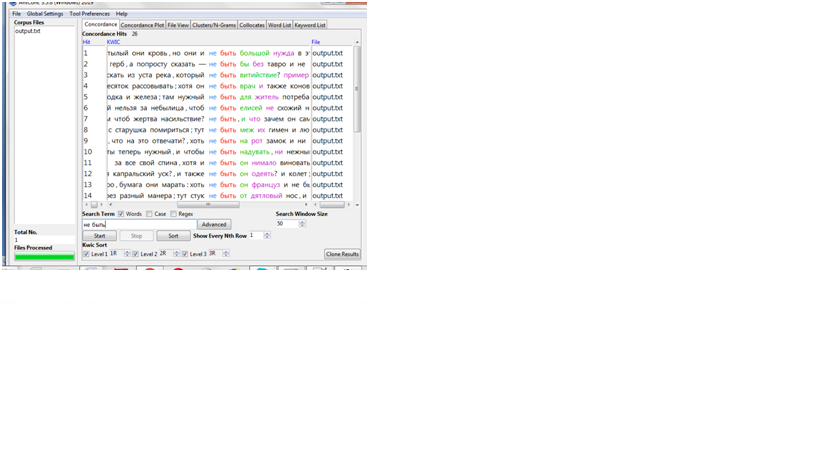
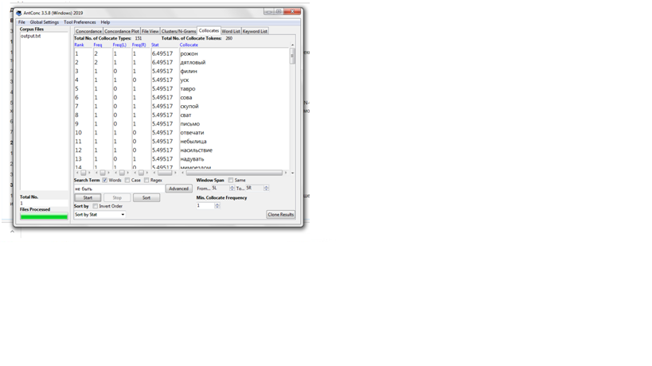
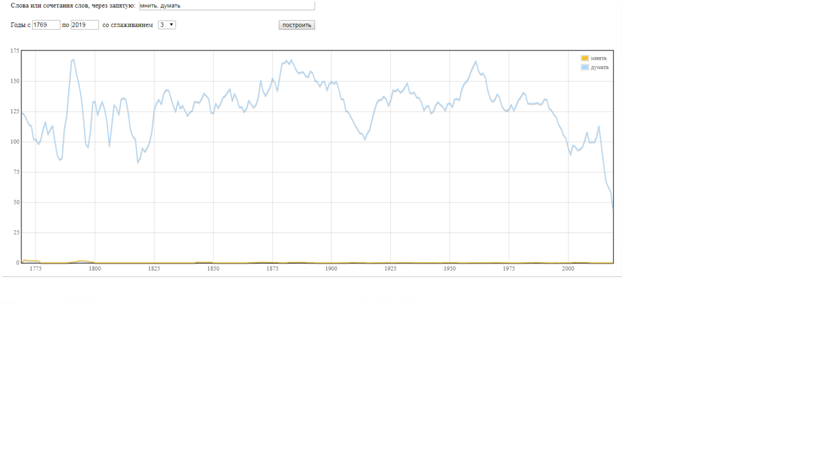
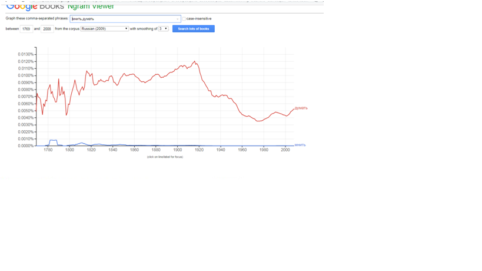
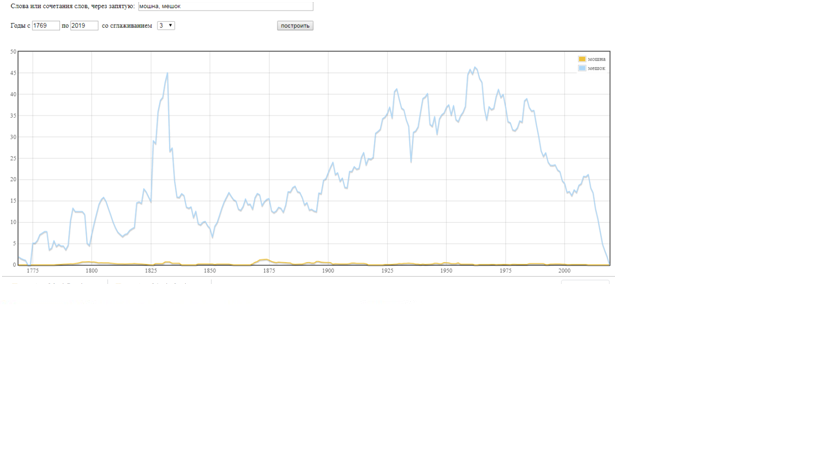
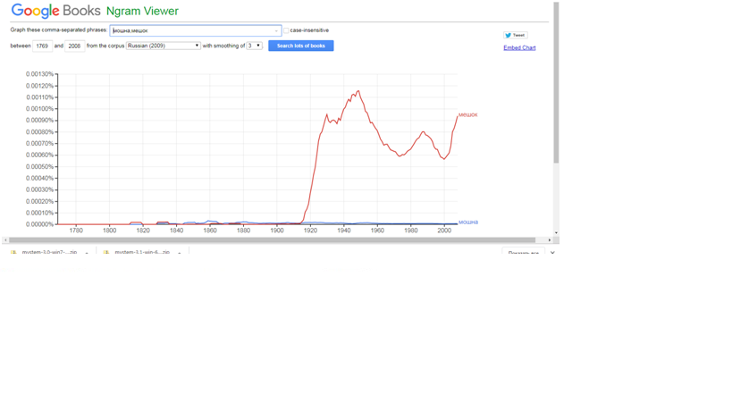
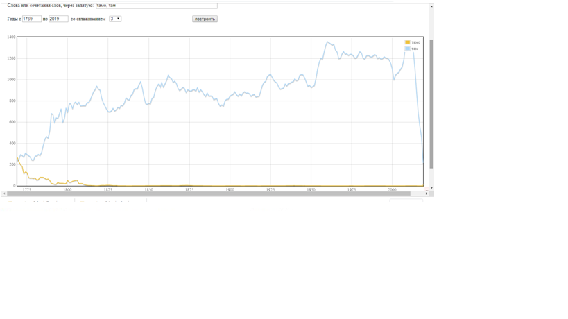
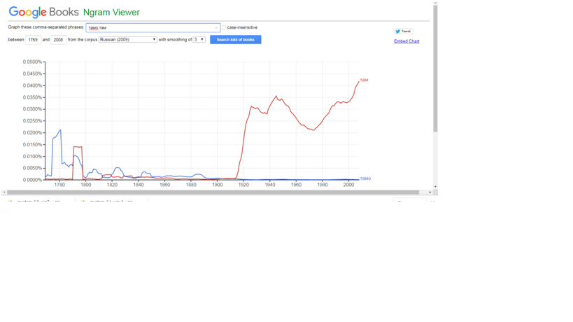
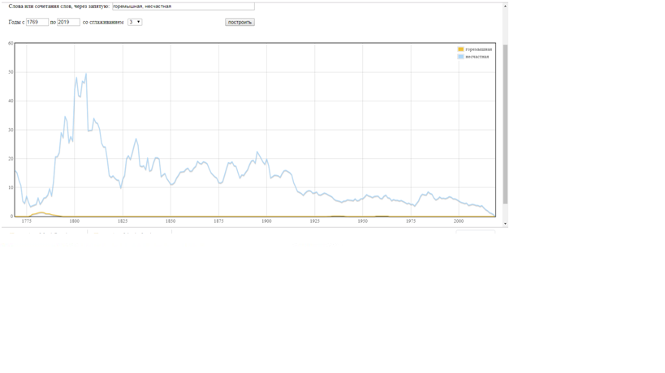
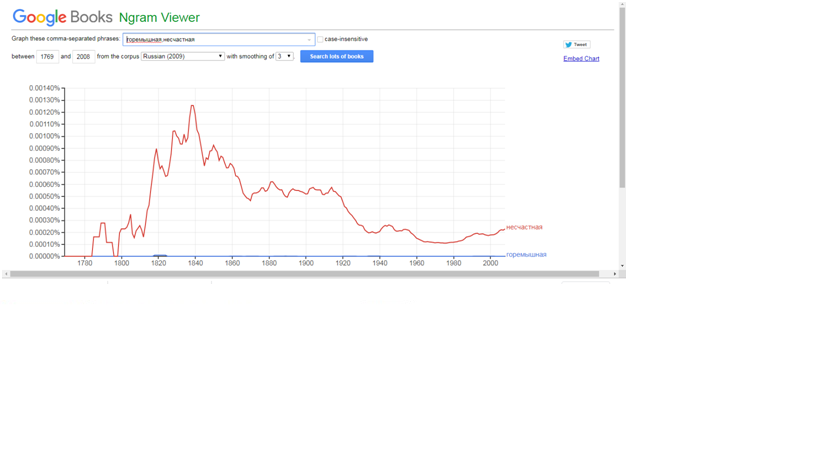

2.Мнить IPM -0,159

Мошна IPM-0,215

Горемышная IPM-0,014

Тамо IPM-3,108

Выводы:
Оба корпуса дают наглядное представление о частоте использования слова в разные года.
Но базы данных НКРЯ и Google Ngrams отличаются, за счёт чего графики употребления одного и того же слова- разные.
Ко всему прочему, русскоязычная база данных   Google Ngrams обновлена до 2009 года, что позволяет нам говорить о большей актуальности НКРЯ.Также у НКРЯ больше ранних источников.

3.Использование корпусов помогло мне лучше понять, как устроен текст изнутри(частота употребления слов, архаизмы). Корпус действительно необходим, если тебя интересует и история отдельных слов. Ведь порой интересно узнать, например, в каком контексте и в какие годы использовалось "музЫка"(чем мы успешно занялись на семинаре).
Конкретное задание также невозможно было бы решить без помощи корпусов:наглядные графики использования устаревших слов, частотность использования и многое другое.
Честно говоря,всё пройденное оказалось совершенно новым для меня.И хотя я и раньше имела дело с НКРЯ,я не представляла,сколько инструментов он предлагает для работы и насколько он может быть полезным.
Главное-с появлением НКРЯ не только моя профессиональная деятельность, но и жизнь стала проще. К примеру, при написании курсовой работы мне нужно было узнать, где встречалась песня, которая была в тексте моего произведения-я сразу же обратилась к корпусу. Другой поучительный случай-после путешествия в город Торжок мне захотелось узнать, кто из писателей писал о нём, кроме Пушкина, и, конечно, мне удалось это сделать благодаря НКРЯ.
